# CapStone Project: Enhancing a Community Library Website
## Background Scenario

You're part of a development team tasked with enhancing the website for the "Greenwood Community Library." The website aims to be more engaging and
informative for its visitors. It currently includes basic sections: Home, About Us, Events, and Contact Us. Your team decides to add a "Book Reviews" section and
update the "Events" page to feature upcoming community events.

You will simulate the roles of two contributors: "Morgan" and "Jamie". Morgan will focus on adding the "Book Reviews" section, while Jamie will update the
"Events" page with new community events.

## Objectives

- Practice cloning a repository and working with branches in Git.

- Gain experience in staging, committing, and pushing changes from both developers.

- Create pull requests and merge them after resolving any potential conflicts.
## Step 0: Create a Repository on GitHub. Name it greenwood-library-website.
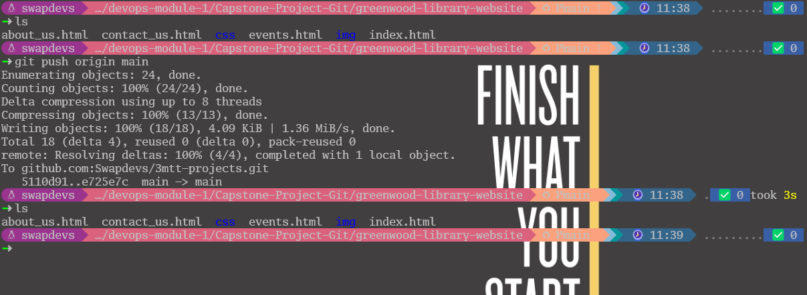
  - Name it greenwood-library-website.
    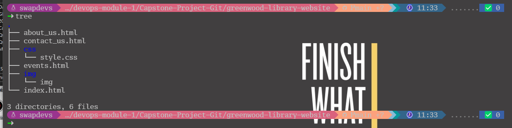
## Step 1: Create a Branch for Morgan
   - Switch to a new branch named add-book-reviews.
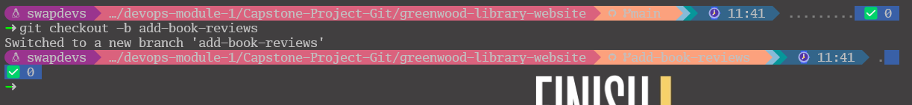
## Step 2: Add a new file book_reviews.html to represent the Book Reviews Section
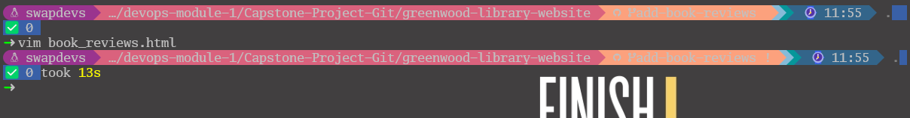
## Push the add-book-reviews branch to GitHub.
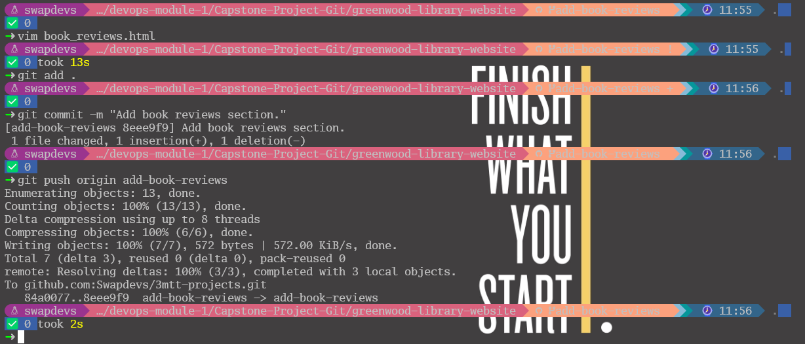
## Step 3: Raise a PR for Morgan's work: 
  - Change the branch from the main to add-book-reviews and click on Contribution
  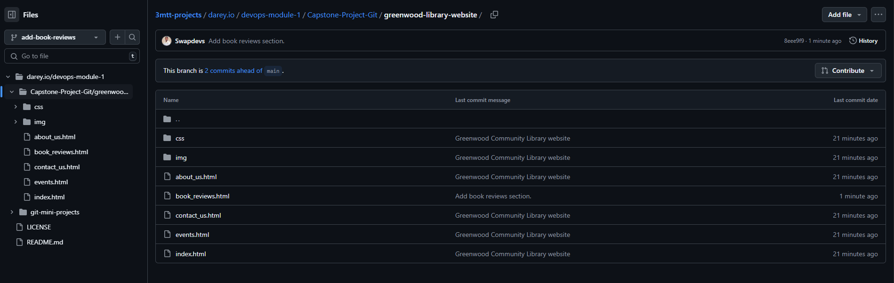
  - Select Open pull request
  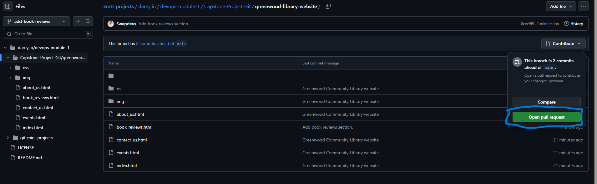
  - Click on create pull request
  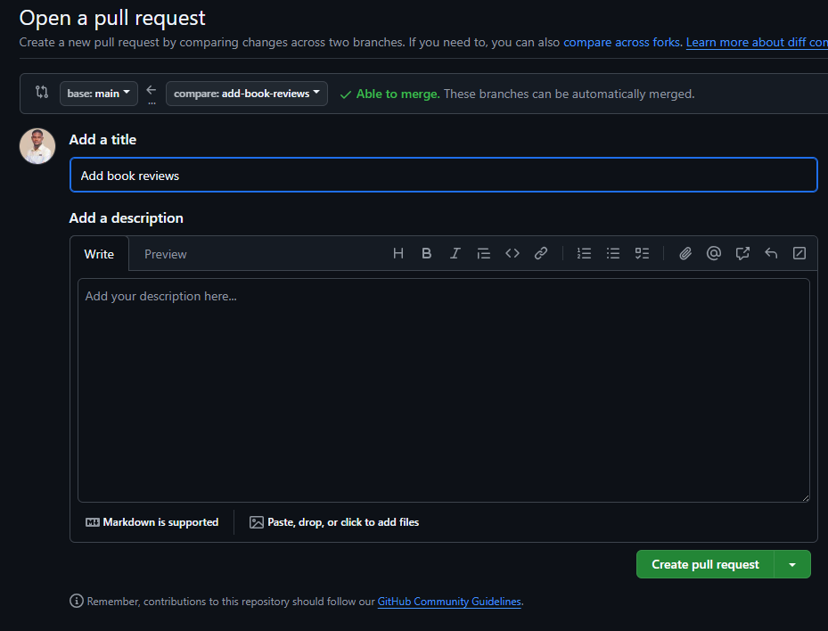
## Step 4: Merge Morgan's work to the main branch: 
  - Click on merge pull to merge to the main branch
  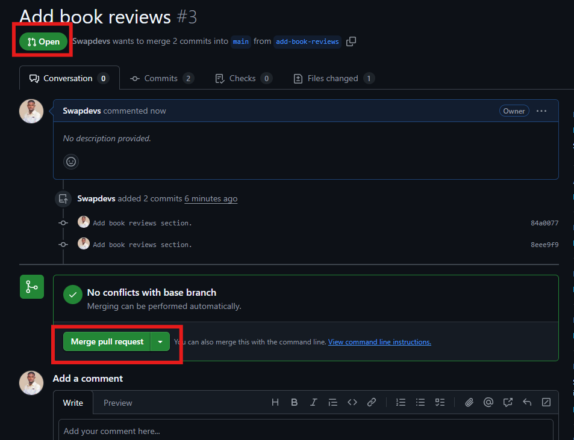
  - Confirm the merge pull before merge to the main branch
  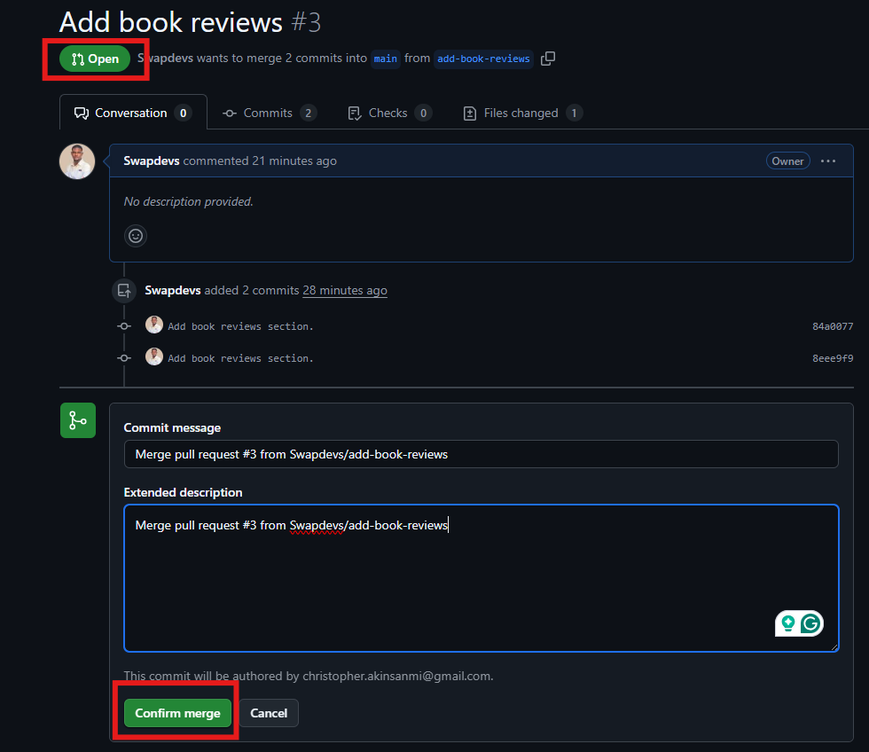
  - Merge Morgan's work to the main branch
  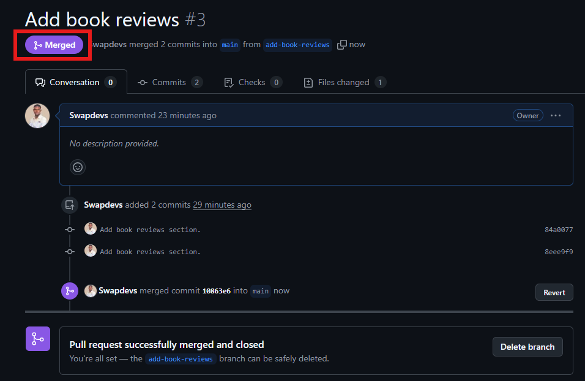
## Step 5: Create a Branch for Jamie
  - Switch to a new branch named update-events.
  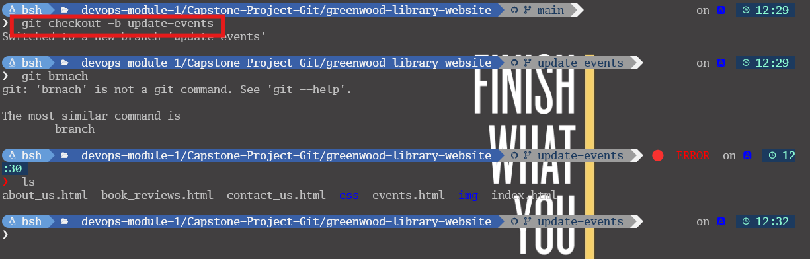
  - Jamie pulled the latest changes from the repository.
  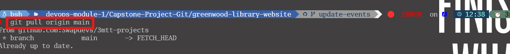
## Step 6: Jamie update the "Events" page with new community events.
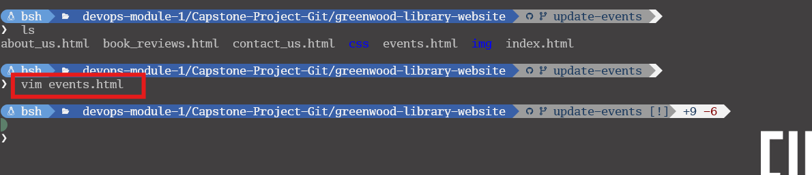
## Push the update-events branch to GitHub.
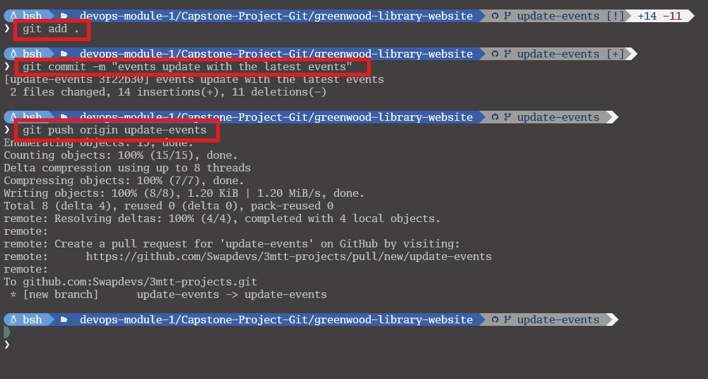
## Step 3: Raise a PR for Jamie's work: 
  - Change the branch from the main to update-events and click on Contribution
  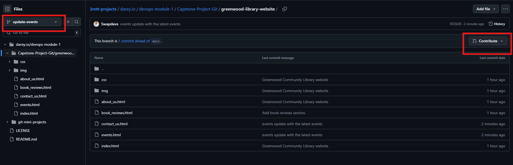
  - Select Open pull request
  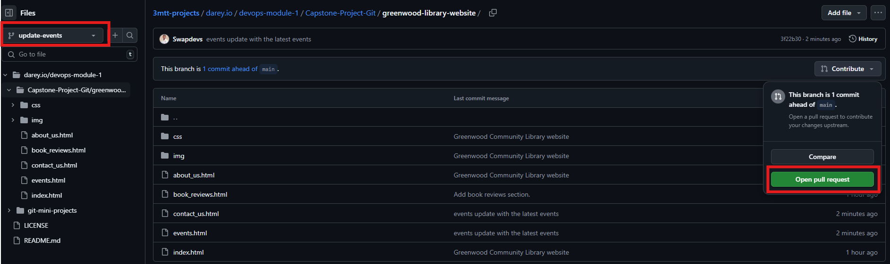
  - Click on create pull request
  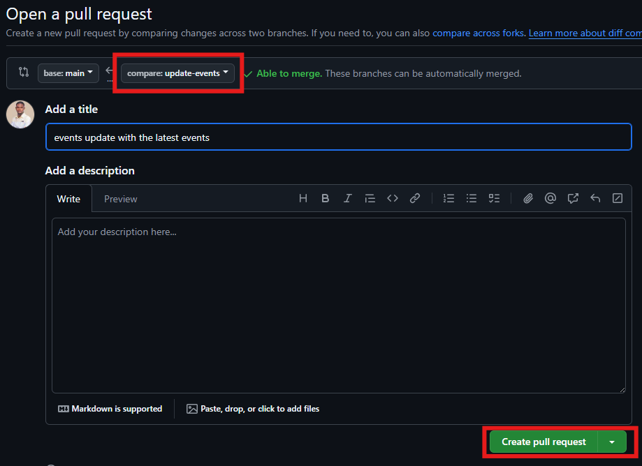
## Step 4: Merge Jamie's work to the main branch: 
  - Click on merge pull to merge to the main branch
  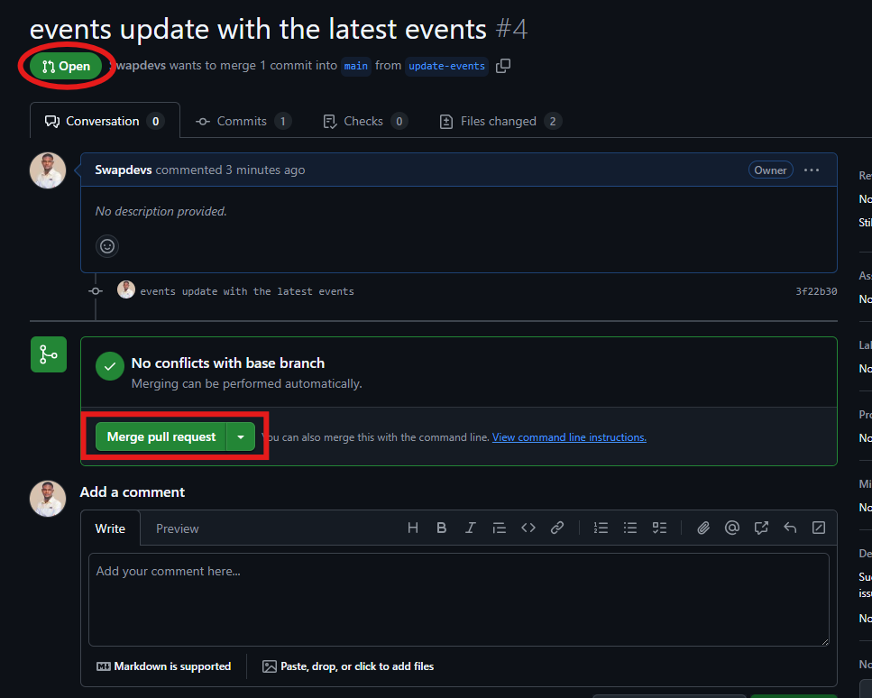
  - Merge Jamie's work to the main branch
  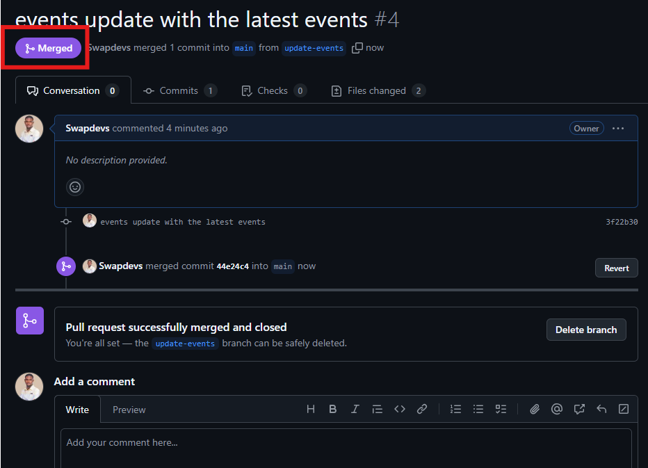
 
