## Mini Project - Git Branching and Merging
### Below are the detailed steps accompanied by a screenshot:
#
- Step 0: Switch to the Branch:- Click on the branch dropdown menu near the top left corner of the file list and select the branch Tom have been working on, in this case, navbar-nav branch.
    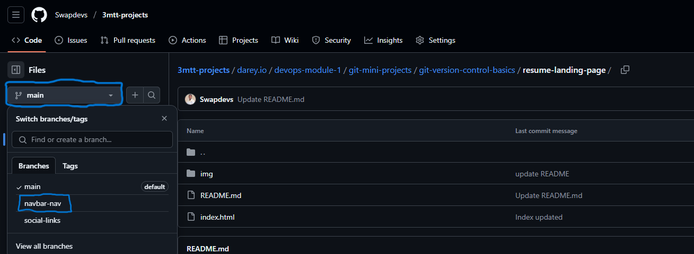
  #
- Step 1: Create New Pull Request:- Click the "New pull request" button next to the branch dropdown menu.
     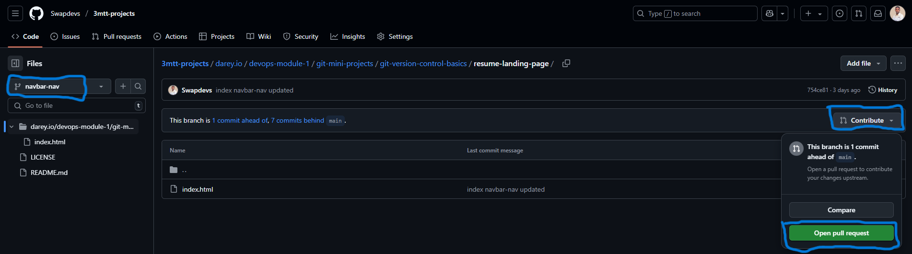
  #
- Step 1: Creating pull request
  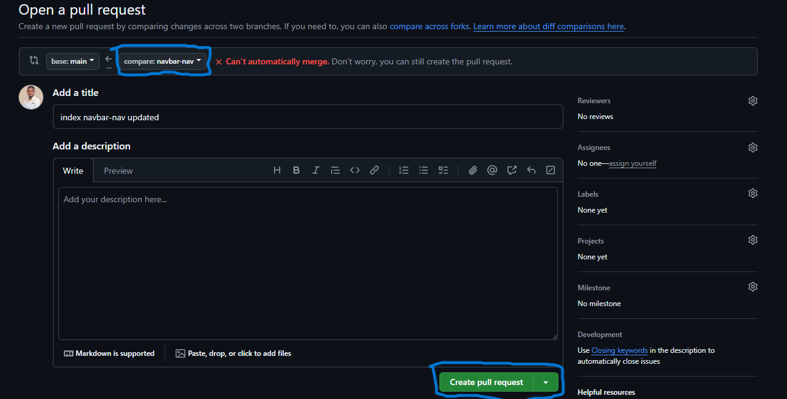
#
- Step 2: Merging the Pull Request into the main branch.
  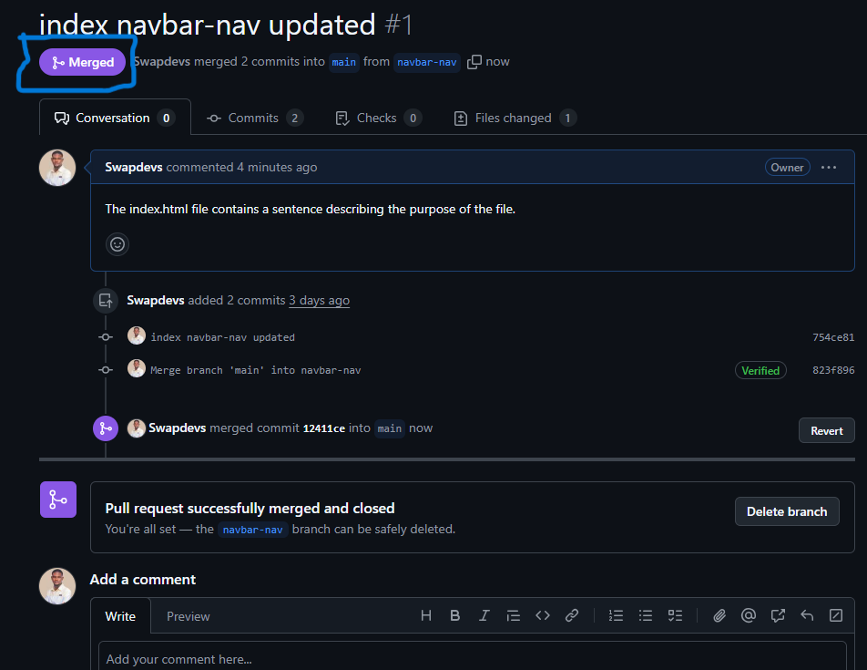
# 
- Step 3: On the terminal, Switch to Jerry's Branch ` git checkout social-links `
    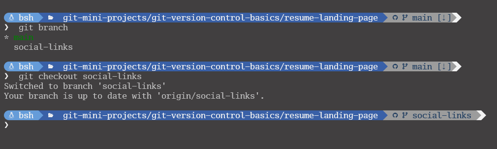
#
- Step 4: Pull the Latest Changes from the Main Branch: ` git pull origin main `
     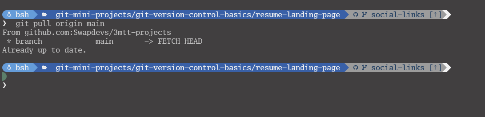
#
- Step 5: Creating pull request
     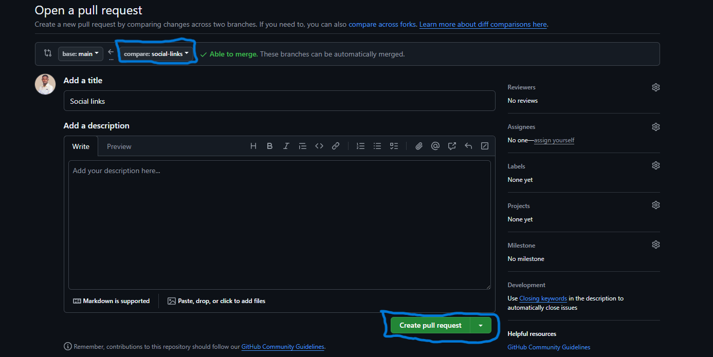
#
- Step 6: Merge the pull request to the main branch: Click the "Merge pull request" button to merge Tom's changes into the main branch.
       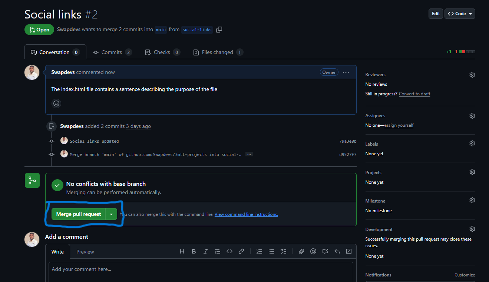
# 
- Step 7: Merging the Pull Request into the main branch.
    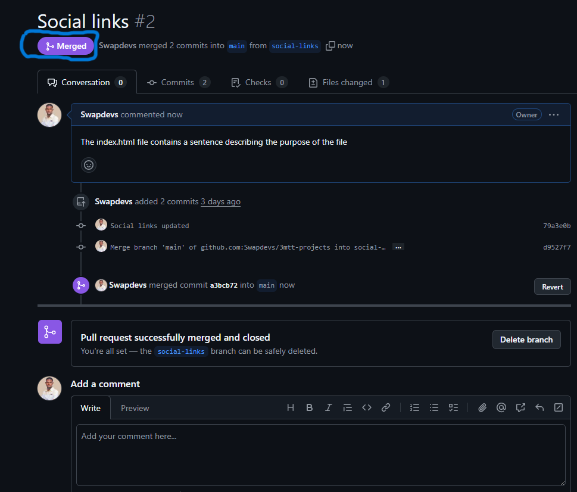
#
- Step 8: Push the Updated Branch to GitHub ` git push origin social-links `
    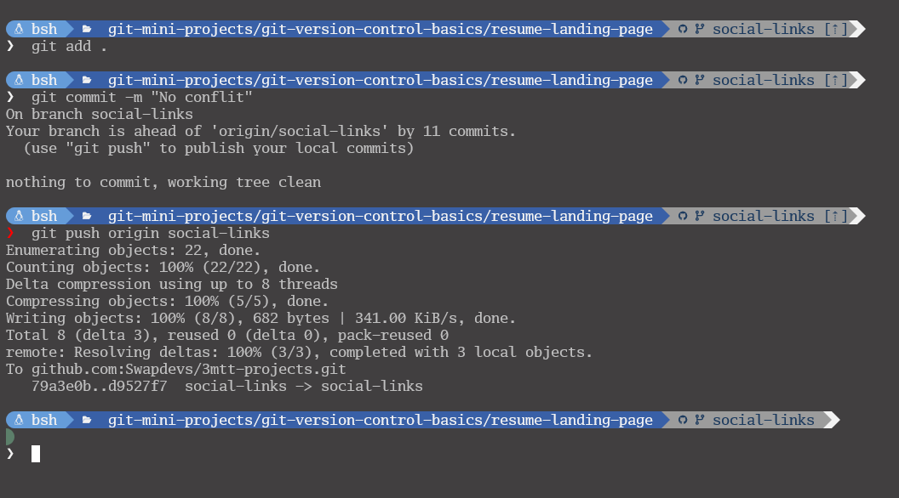
# 
- Step 9: Checkout main and Push the Updated maun Branch to GitHub
    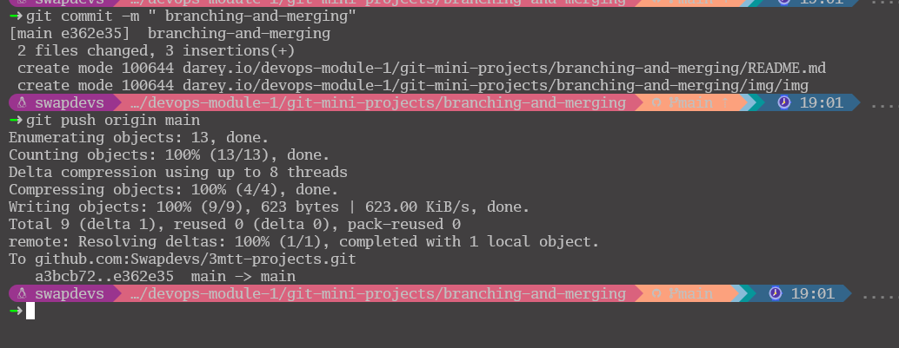
