# Mini Project-Advanced Linux Commands
## Task 1:
- Creating a new user
  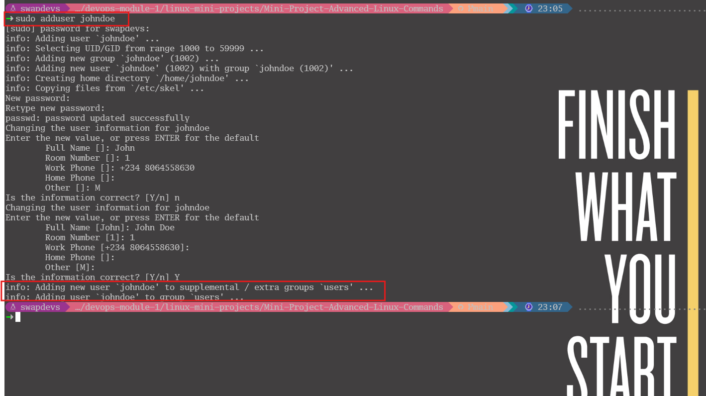
- Granting administrator privileges
  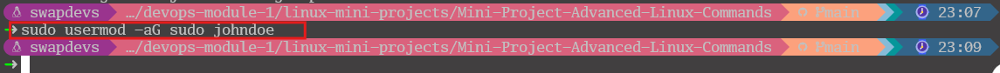
- Log out and log back in as the newly created user
  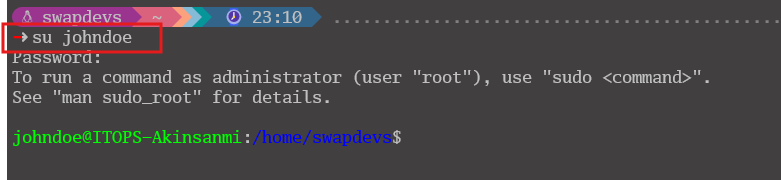
- Navigate to the ` /home/johndoe' directory to explore what has been created.
  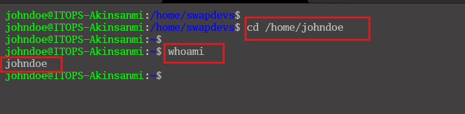
## Task 2:
- Changing User Password
  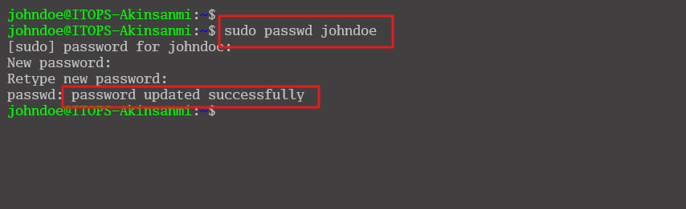
- Log back in as the newly created user
  
  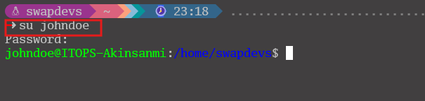
## Task 3:
- Create a group on the server and name it `devops`
  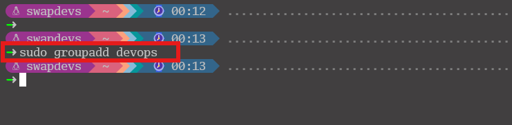
- Create 5 users `["mary", "mohammed", "ravi", "tunji", "sofia" ]`, and ensure each user belongs to the devops group
  - Use a Bash script to automate the creation of user accounts.
    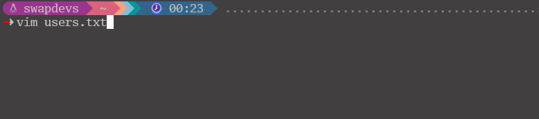
    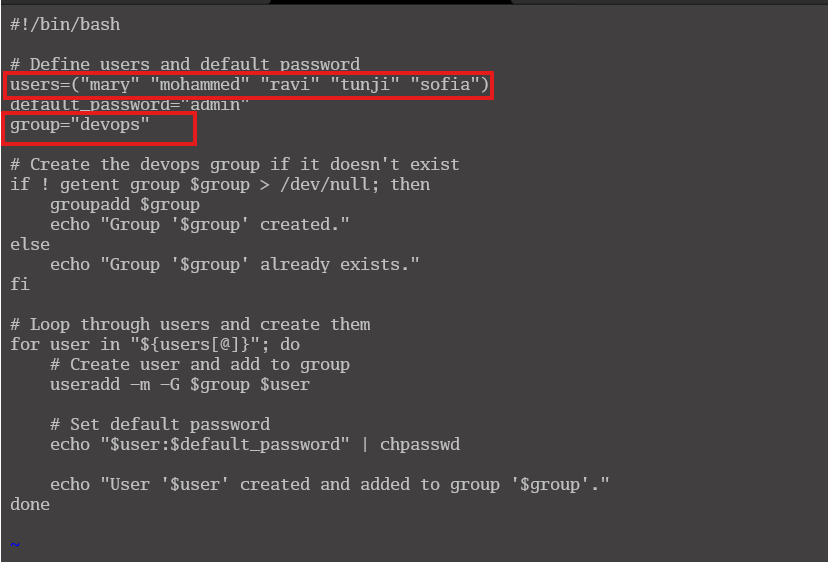
  - Use the appropriate command to modify the permissions of users' files.
    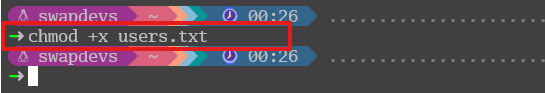
  - Here is the output confirming the user creation.
    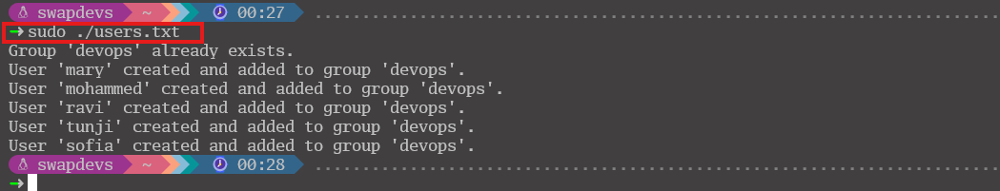
  - To list all local users on a Linux system, you can filter users with UID ≥ 1000 (normal users)
    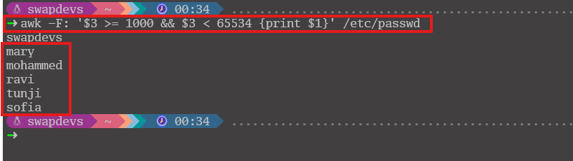
- Create a folder for each user in the `/home directory`. For example `/home/mary`
  - Use a Bash script to automate the creation of user directories
    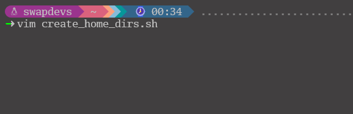
    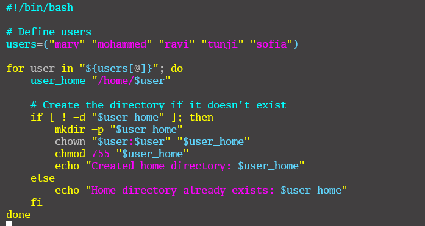
  - Here is the output indicating that the directory was successfully created.
    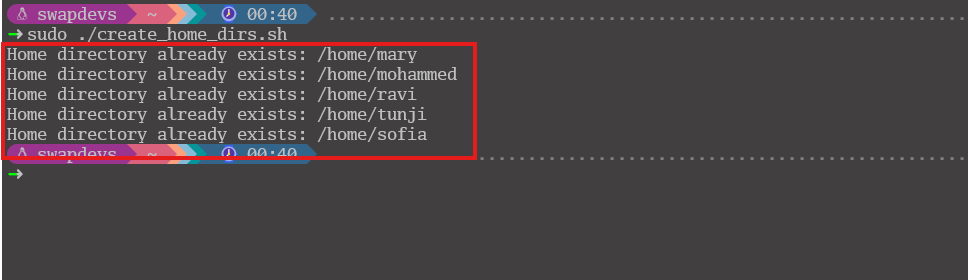
- Ensure that the group ownership of each created folder belongs to "devops"
  - Verify the group ownership of the file or directory
    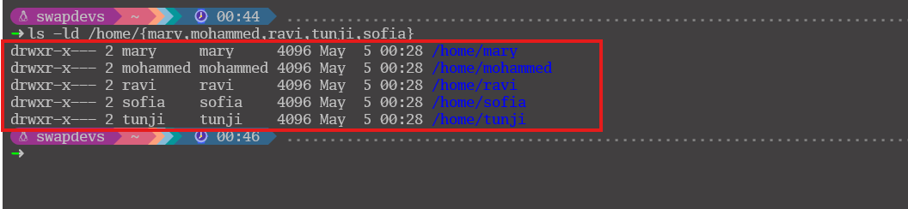
  - Write a Bash script to automatically adjust group ownership for specific files or directories.
    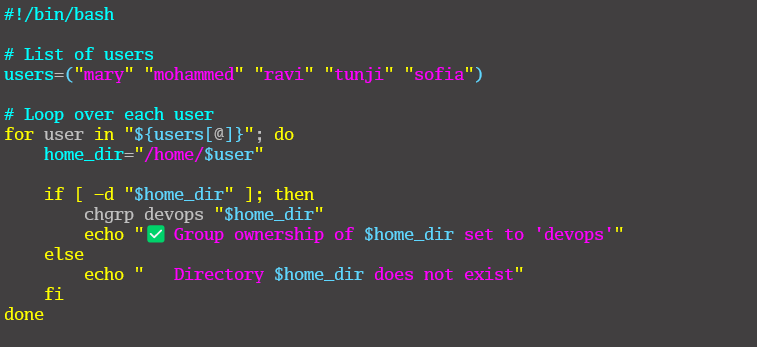
  - Here is the output indicating that the issue was successfully fixed.
    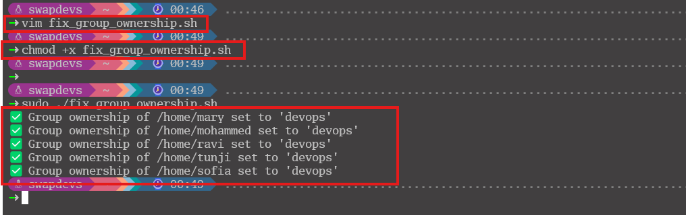
  - Verify the group ownership of the file or directory again.
    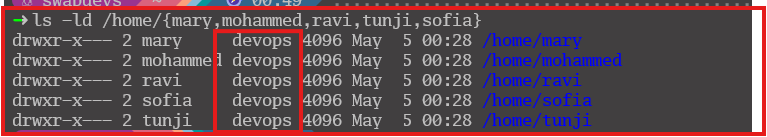
  
