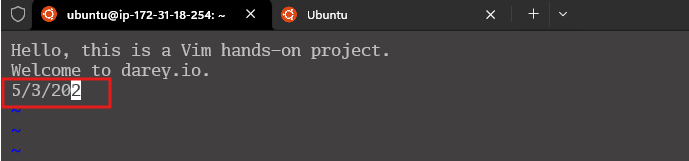
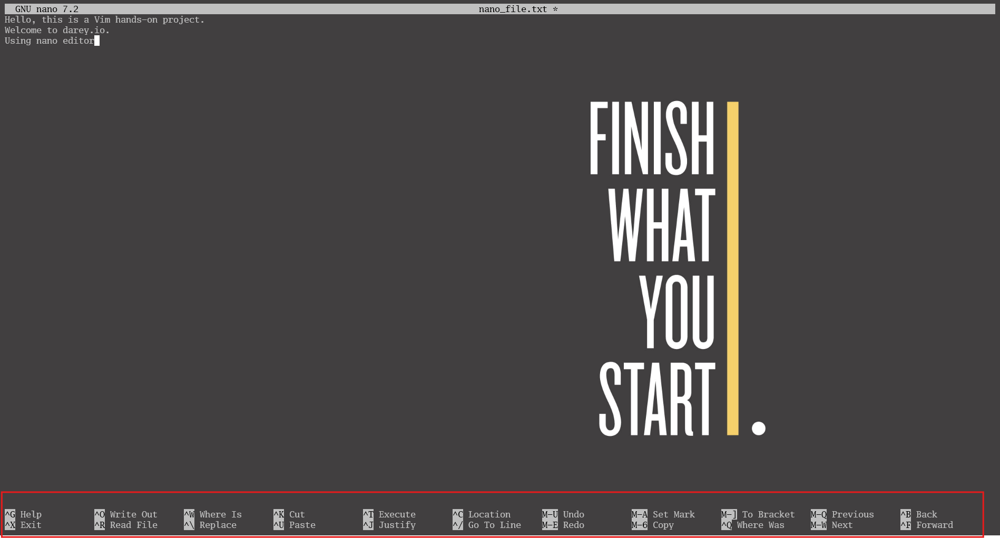
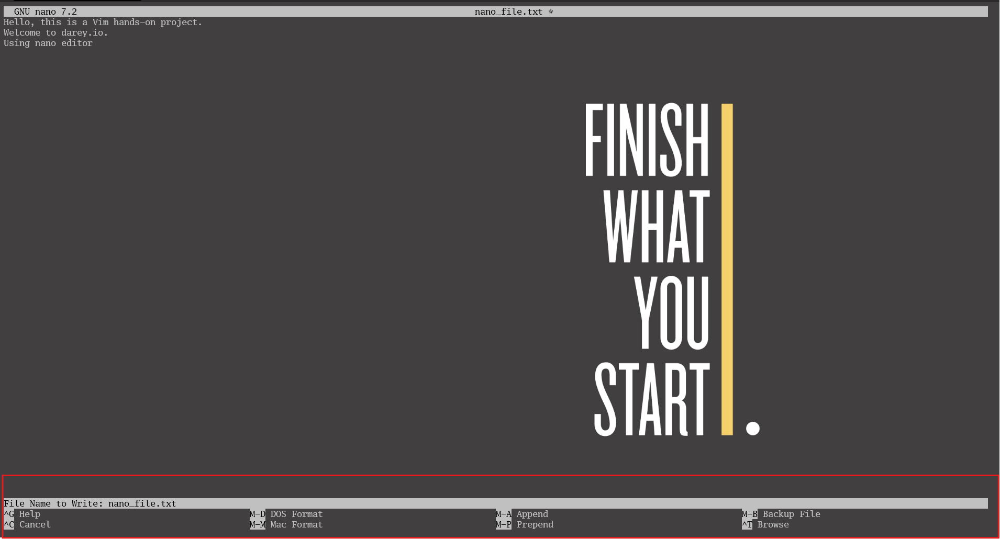

# Mini Project- Linux Text Editor
## Working With VIM Editor
- **Open a new file** named "exercise.txt" using the following command
  
- Enter Insert Mode to edit the file.
  - Press `i` to enter Insert mode.
  
- **Deleting a Character:** Press `esc` on your keyboard to exit the ` insert mode`. Position the cursor on a character you want to delete and press x.
  
- **Undoing Changes:** Make a change (add or delete text) in Insert or Normal Mode, then press Esc to enter Normal Mode and press u to undo the last change.
  
  
- **Saving Changes:** After you have finished writing into the file, press ` esc`, then type `:wq` and press Enter. This will save the file. `w` means `write` and `q` means quit, which basically quits the vim mode and returns to the terminal.
  
- **Listing files:** The `ls` command displays all files in the current directory
  

## Working With Nano Editor
- **Opening a File:** named "nano_project.txt" using the following command: `nano nano_file.txt`
 
- **Entering and Editing Text:** Type a few lines of text into the file. Nano has a simple interface, and you can start typing immediately.
  
- **Saving Changes:** Save your changes by pressing `ctrl` +`o`. Nano will prompt you to confirm the filename; press `Enter` to confirm.
  
- **Listing files:** The `ls` command displays all files in the current directory
  
- **Opening an Existing File:** Open an existing file (if available) using the following command:
  
