# Mini Project-Linux Fundamentals
## Step 0: Create a Linux server on AWS
- Register a new AWS account
- Sign in to your AWS account
- On the top left, select services and search for Elastic Cloud Compute (EC2).
  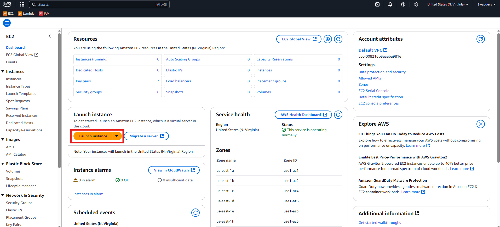
- From the menu on the left side, select instances.
- Select the launch instance on the top right side.
  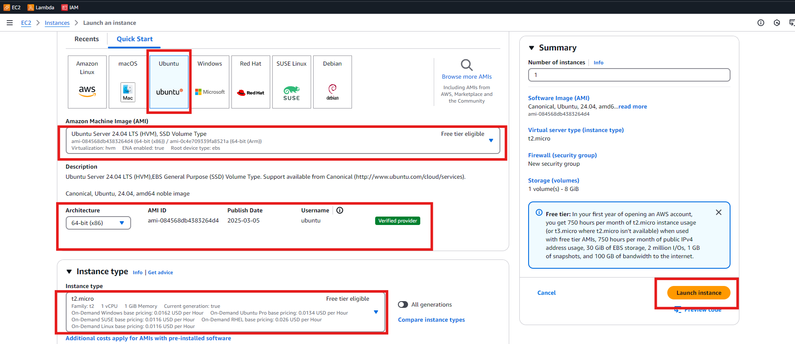
- Confirm the status of the Instance
  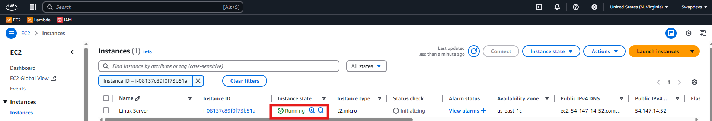
- Instance summary
  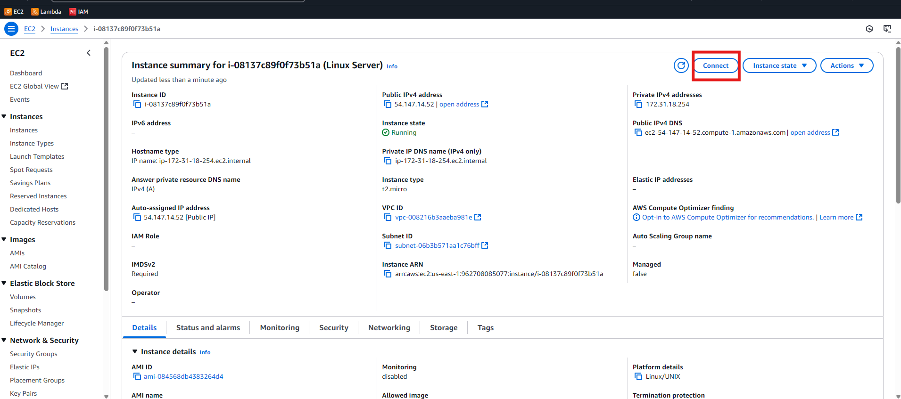
- Connect to the instance using SSH
  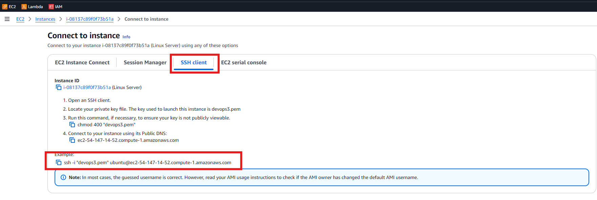
## Step 1: Connecting to the server using SSH. Run the command below.
  `ssh -i "devops3.pem" ubuntu@ec2-54-147-14-52.compute-1.amazonaws.com`
  ### Let's break down the command:

  `ssh`: This is the command to initiate an SSH connection. SSH is a protocol used to securely access and manage a remote system over an unsecured
  network (The Internet is an unsecured network).

  `-i "ubuntu.pem"`: The -i option specifies the path to a private key file used for authentication. In this case, "ubuntu.pem" is the private key file. This file is
  essential for proving your identity to the server without needing a password. The .pem file is often used when connecting to servers, for example, those
  hosted on AWS (Amazon Web Services).

  `ubuntu@public_ip_address`: This part specifies the user and the server you're trying to connect to. `ubuntu` is the username on the remote server that you're
  logging in as, and `public_ip_address` should be replaced with the actual public IP address (or hostname) of the server you're trying to access. 
  The `@'symbol separates the username from the server's address.

  Once you establish a successful connection, you should see an output like the one below, which proves that you have successfully connected to your remote server.
  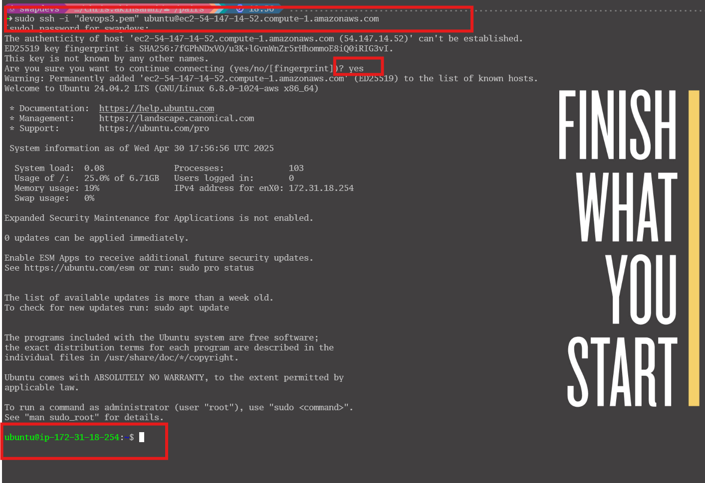
## Step 2: Installing, Updating and Removing Software
  Since we are already on an Ubuntu-based server, let's explore how to install tools on a Linux server.
- **Updating Package Lists** Before installing new software or updating existing packages, it's important to refresh the package lists.
  `sudo apt update  # For Debian/Ubuntu-based systems`
  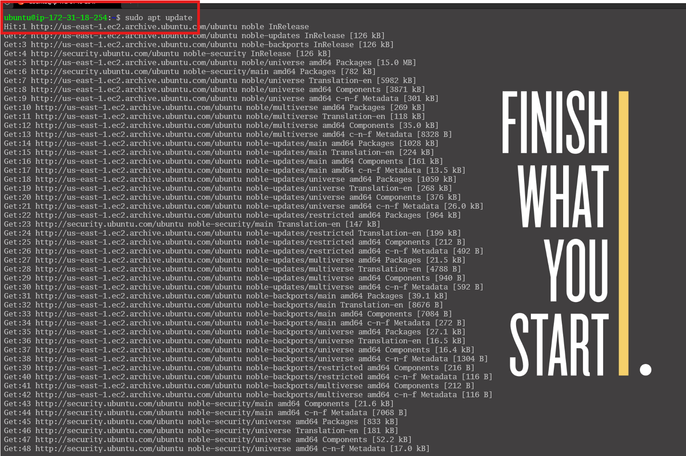
- **Installing Software Packages** Lets try to install a command called ` tree`
  The `tree` command is commonly used to visually see the file system structure on a linux server. So let's install it with the command below.
  Debian/Ubuntu
  ` sudo apt install tree`
  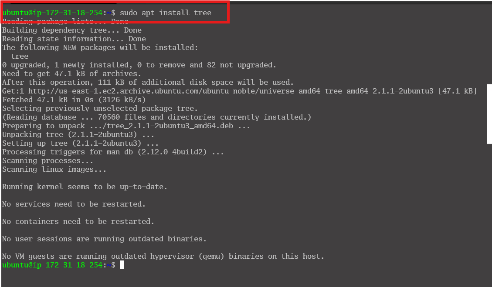
- **Verifying Installed Packages** To confirm that the desired package or software has been successfully installed, simply run the ` tree` command, and specify the path you want to see the tree structure.
  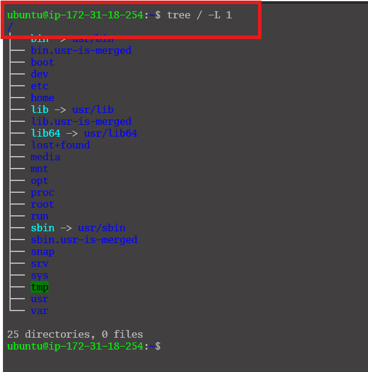
- **Updating Installed Packages** Keep your system up-to-date by updating installed packages.
  ` sudo apt upgrade`
  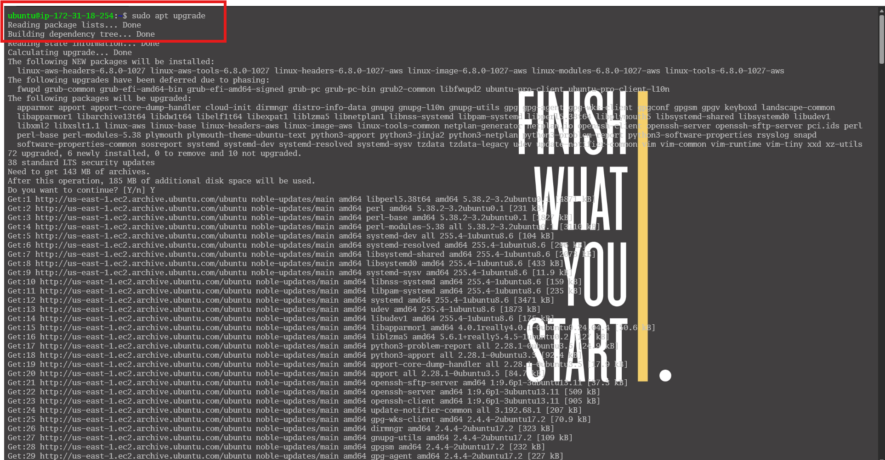
- **Removing Software Package** To remove the ` tree` package we installed earlier, run the below command.
  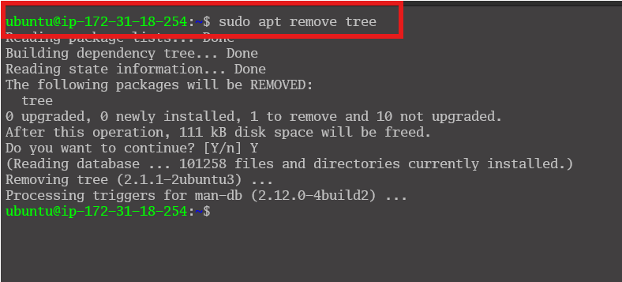
  
