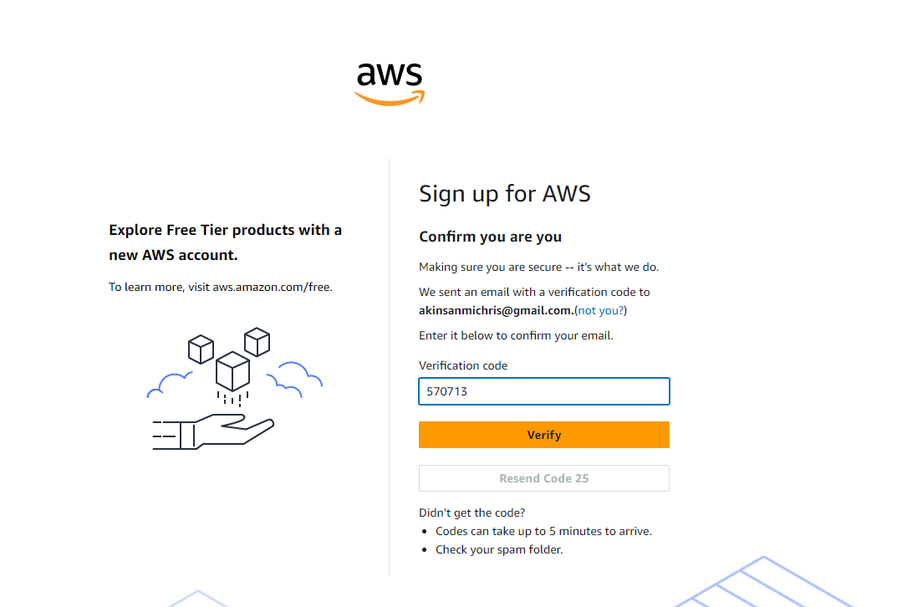

# Setting Up Your AWS Account

* **Step1:** Open the Create AWS account
  * Click on Create an AWS account [Create an AWS account](https://aws.amazon.com/console/)
    
  * Enter the valid required details like Email address, Password and AWS account name.
    
    
  * Check respective email.
    * You'll receive a verification code there, copy that verification code.
    * click on verify
      
  * The registration process will ask your Personal Information.
    * Enter all the Information and click on continue.
      
  * Provide your payment information for verification purposes.
    * Rest assured, they will not charge you unless your usage surpasses the AWS Free Tier limits.
      
      
* **Step2:** Sign in to AWS account
  * After completing the setup process, you can access the AWS Management Console using your new AWS account credentials.
  * Select 'Root user' and enter your registered email address.
    * Then click 'Next' to proceed.
        
    * You have successfully logged in to your Amazon Web Services account.
      
      
