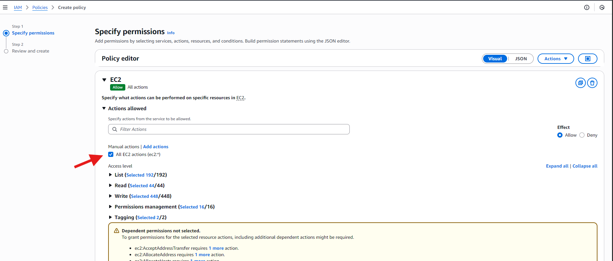

# AWS Identity and Access Management Mini project.
### Best Practices:

- Give only the permissions needed: Don't give more access than necessary.
- Use roles instead of users: Roles are safer and can be used when needed.
- Review roles regularly: Remove unused roles to keep things tidy and secure.
- Add extra security with MFA: Use Multi-Factor Authentication for extra protection.
- Use ready-made policies: They're safer and easier to use.
- Keep policies simple: Make separate policies for different tasks.
- Keep track of changes: Keep a record of who changes what.
- Test policies before using them: Make sure they work the way you want them to before applying them to real stuff.
- Use descriptive names: Choose clear and descriptive names for IAM groups to facilitate understanding and management.
- Enforce strong password policies: Encourage users to create strong passwords and implement expiration and complexity requirements.

### The practical part:

- A growth marketing consultancy company called GatoGrowFast.com wants to give some access to their employee Eric, Jack and Ade to the AWS resources. Let's see how it is being set up.
- We'll do it in two parts. In the first part of the practical, we'll create a policy granting full access to EC2. Then, we'll create a user named Eric and attach that policy to him.
- In the second part, we'll create a group and add two more users, Jack and Ade, to that group. Afterwards, we'll create a policy for granting full access to EC2 and S3, and attach it to the group.

## Part-1

1. Navigate to the AWS Management Console.
   - Use the search bar to locate the Identity and Access Management (IAM) service.
     
2. Now, on the IAM dashboard, navigate to the left sidebar and click on "Policies."
   - From there, search for "EC2" and select "AmazonEC2FullAccess" from the list of policies.
   - Proceed by clicking on "Create policy" to initiate the policy creation process.
     
3. Now, select all EC2 actions.
   
4. Tick "All resources" and click "Next."
   
5. Now, click on Create policy
   
   - This is the policy we have created.
     
6. Now, proceed to the "Users" section, and select the option to "Create User."
   
7. Enter the desired username for the user.
   - Then select the option "Provide user access to the AWS Management Console" if access to the web-based console interface is required.
   - Proceed to set up a password for the user.
   - Check the box "Users must create a new password at next sign-in" if allowing users to change their password upon first sign-in is preferred.
     
8. Select "Attach policy directly" and navigate to "Filter customer managed policies."
   - Choose the policy you created named "policy_for_eric."
   - Then proceed by clicking "Next."
     
    #### Note- AWS policies:
     - Managed Policies: Made by AWS, used by many
     - Customer Managed Policies: You make and manage them.
     - Inline Policies: Made for one specific thing.
9. Next, click on "Create User."
    
10. Ensure to save these details securely for future reference.
    - Click on "Return to user list"
      
