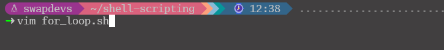
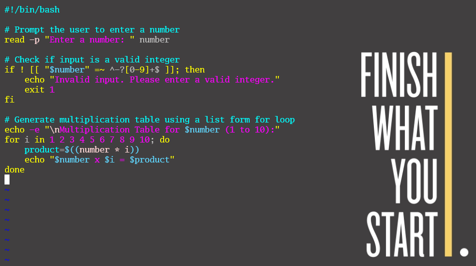
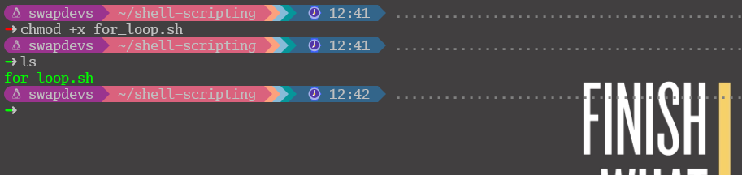
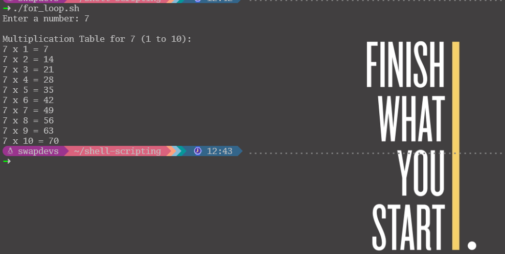
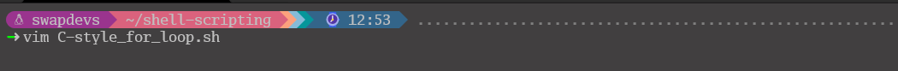
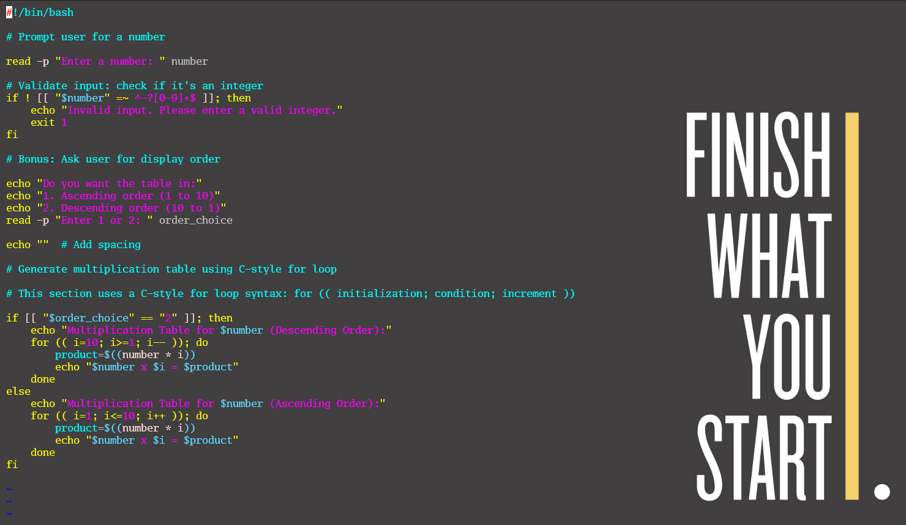
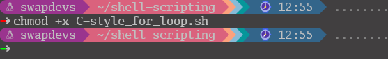
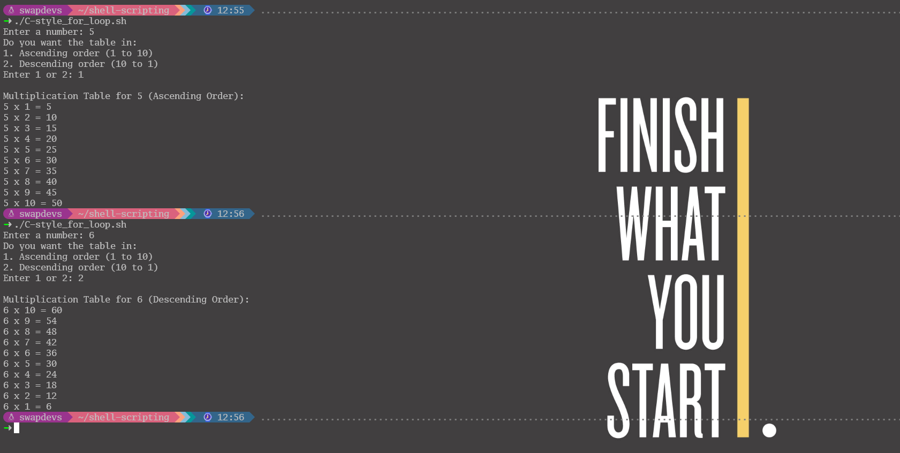

# Bash Script For Generating a Multiplication Table
**Objective:** Create a Bash script that generates a multiplication table for a number entered by the user. This project will help you practice using loops, handling user input, and applying conditional logic in Bash scripting.
## Part 1: Using List Form For Loop
   * **Create a For Loop Script File:**
      * Use the command `vim for_loop.sh` to create a new Bash script file for the loop.
        
   * **Write the List Form For Loop Code:**
      * Add a `for` loop that iterates over a list of items within the `for_loop.sh` file.
        
   * **Make the Script Executable:**
      * Grant execution permission to the script using the command:
        ```bash
        chmod +x for_loop.sh
        ```
        
   * **Execute the Script and View Output:**
      * Run the script using `./for_loop.sh` to display the output generated by the list-based `for` loop.
        

## Part 2: Using C-style For Loop
   * **Create a C-Style For Loop Script File:**
      * Use the command `vim C-style_for_loop.sh` to create a new Bash script file.
        
  * **Write the C-Style For Loop Code:**
    * Inside `C-style_for_loop.sh`, write a `for` loop using the C-style syntax.
    * 
  * **Make the Script Executable:**
    * Grant execution permission using the correct command:
      ```bash
      chmod +x C-style_for_loop.sh
      ```
      
  * **Execute the Script and View Output:**
    * Run the script using:
      ```bash
      ./C-style_for_loop.sh
      ```
      
