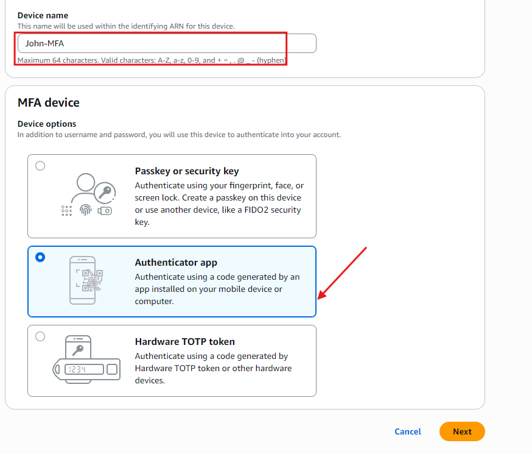

# Introduction to Cloud Computing - Security & Identity Management (IAM)
## Creating IAM Users

An IAM user is a unique identity within an AWS account that represents a person or service, granting specific permissions to access and interact with AWS
resources under controlled and customizable security policies.

Imagine that you have a big, secure building **(AWS account)** that you own and control. When you first get the keys to this building, you're given a master key
**(root user)** that can open every door, access every floor, and make changes to the building's structure itself.

This master key is powerful, allowing you to do anything from adding new rooms (services) to changing the locks **(security settings)**. However, because this key
can do so much, it's also very risky to use it for daily tasks, like if you lost it, someone could do anything they want with your building.

Now, imagine you have specific tasks that need to be done in the building, like cleaning, maintenance, or security checks. You wouldn't give out your master key
to every person who needs to do those jobs. Instead, you create specific keys **(IAM users)** that can only open certain doors or access certain floors. These keys
are less powerful but much safer to use for everyday tasks. They ensure that the people holding them can only access the parts of the building they need to do
their jobs and nothing more.

Let's set up IAM users for a backend developer, John, and a data analyst, Mary, by first determining their specific access needs.

As a backend developer, John requires access to servers **(EC2)** to run his code, necessitating an IAM user with policies granting EC2 access.

As a data analyst, Mary needs access to data storage **(AWS S3 service),** so her IAM user should have policies enabling S3 access.

Considering **Zappy e-Bank's** plan to expand its team with 10 more developers and 5 additional data analysts in the coming months, it's inefficient to create similar policies for each new member individually. 
A more streamlined approach involves:

1. Crafting a single policy tailored to each role's access requirements.
2. Associating this policy with a group specifically designed for that role.
3. Adding all engineers or analysts to their respective groups simplifies the management of permissions and ensures consistent access across the team.

## Create policy for the Development team

1. In the IAM console, click on policies
   
2. Click on Create Policy
   
3. In the select a service section, search for EC2
   
4. For simplicity's sake, select the "All EC2 actions" checkbox
   
5. Also, make sure to select "All" in the Resources section.
   
6. Click Next. (Create policy for the Data Analyst team)
7. Provide the names of the developers and the Data Analyst team, along with a description of the policy. "Repeat the process above for the Data Analysts team, but instead of EC2, search for S3. Also name the policy       analyst instead of developers. You can give it any description of your choice." 
   
8. Click on Create Policy
   

## Create a Group for the Development team

1. In the IAM console navigation, select User group and in the top right, click Create group
   
2. Provide a name for the group
   
   
4. Attach the developer policy we created earlier to the group. This will allow any user in the Development-Team group to have access to EC2 instances alone
   
5. You have successfully created a group and attached a permission policy for any user added to the group to have access to the EC2 instance only. Recall that users in this group will be backend developers only.
   
   

## Creating IAM User for John

Let's recall that John is a backend developer; therefore, he needs to be added as a user to the Development-Team group

- Navigate to the IAM dashboard, select "Users" and then click "Create user".
  
- Provide the name of the user. In this case, "John"

- Ensure that the user can access the AWS Management Console. If this is not selected, the user will not be able to log in from the web browser.
  
- Permissions: Add John to the development team group.
  
- Click on Create User
  
- Download the login credentials for John
  

## Setting Up MFA for John

1. Click on User and then click on John. It is assumed we have already created a user account for John
   
2. Click on enable MFA as shown in the image below
   
3. Enter a device name for John MFA and select the authenticator app
   
4. Click on Next
5. Open your Google Authenticator or Microsoft Authenticator application on your mobile device to scan the QR Code, then you can fill in the 2 consecutive codes as shown in the image below.
   
6. By completing steps 1-5, MFA will be enabled for John
   
