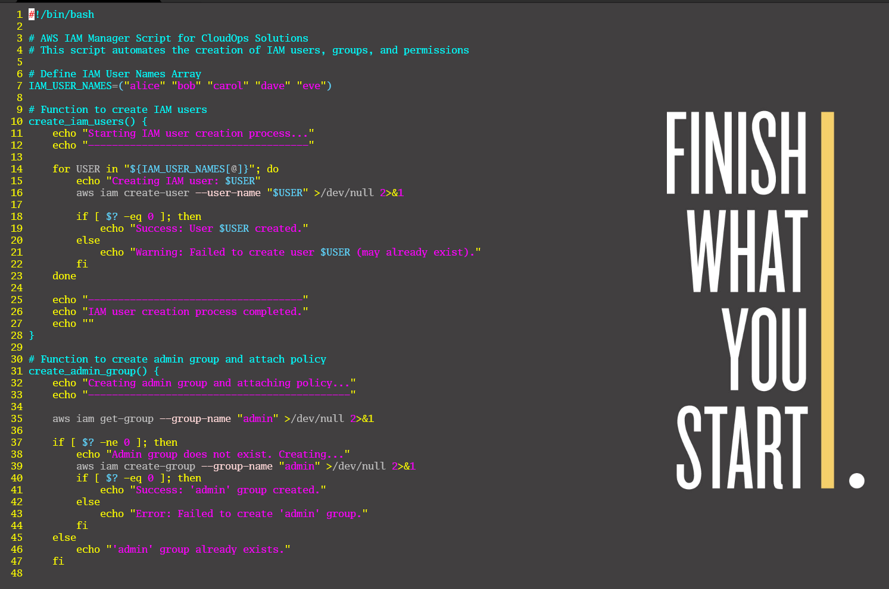
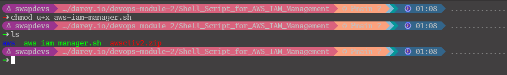
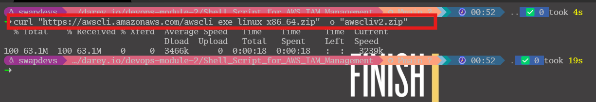
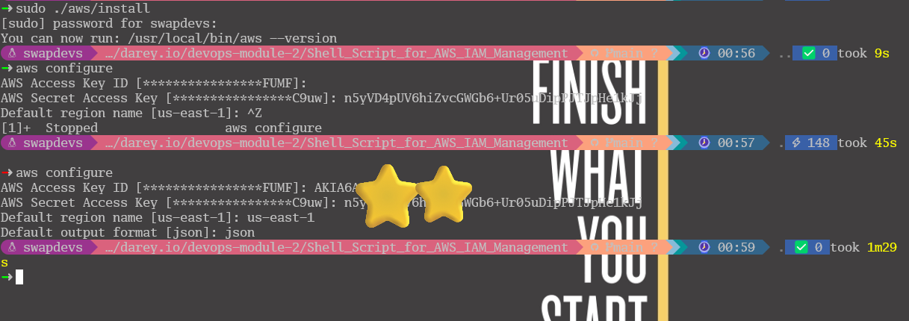
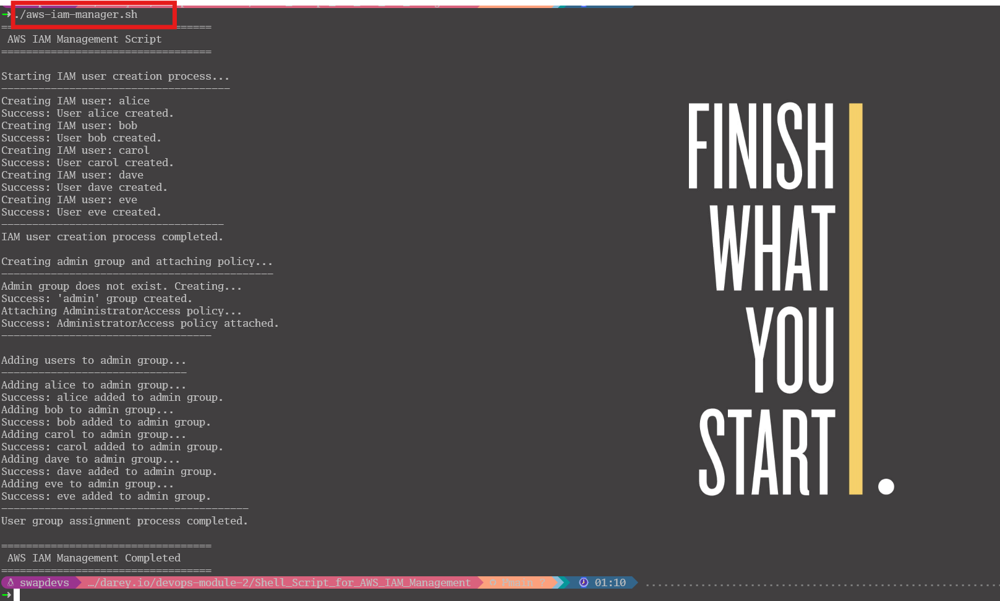
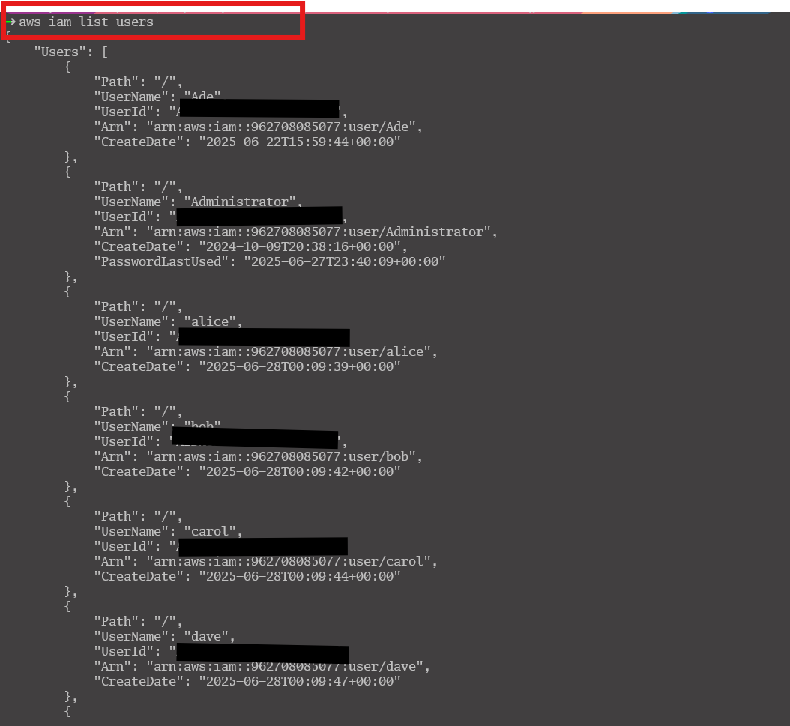
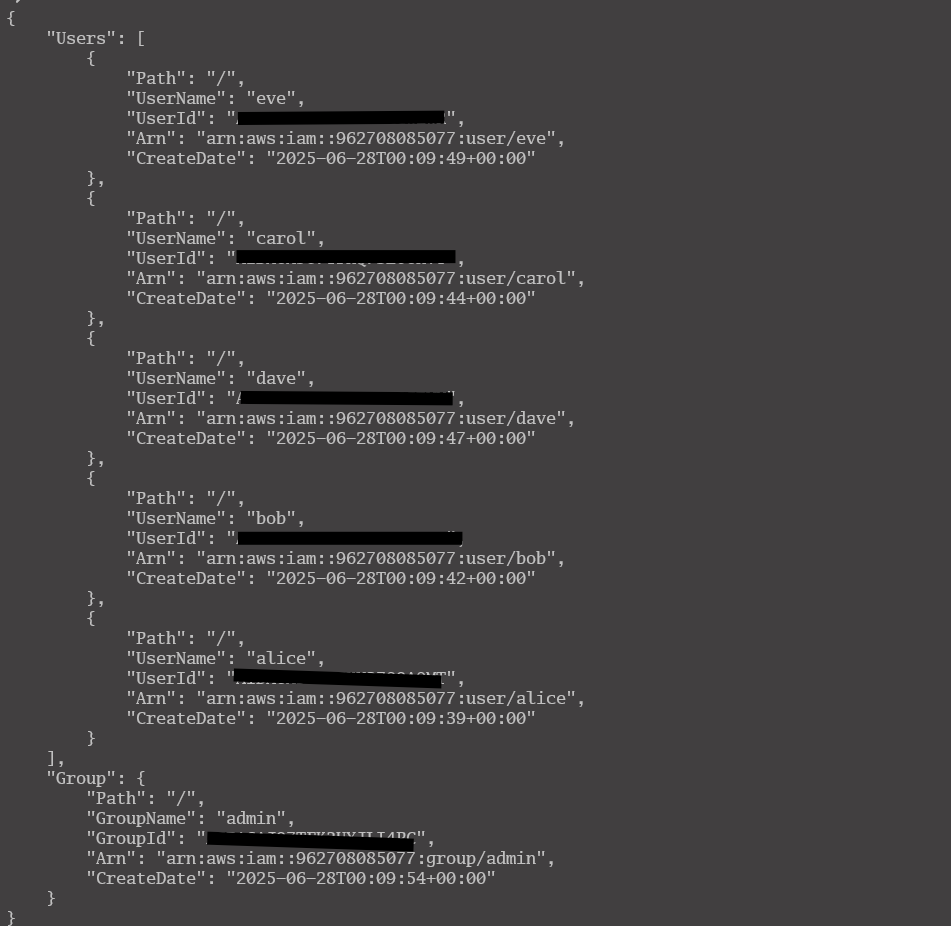
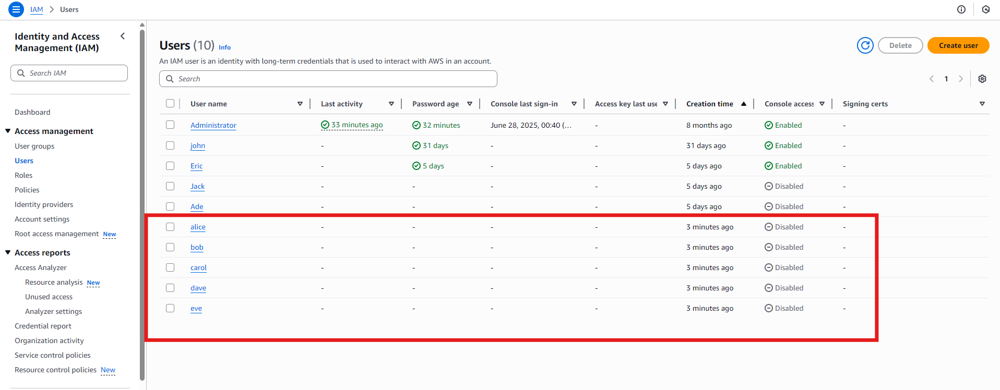
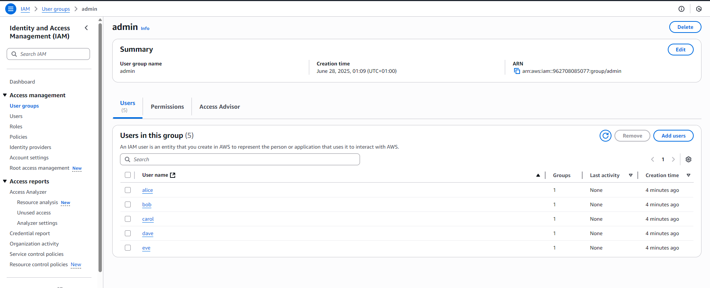

## Shell Script for AWS IAM Management
1. Script Objective & Structure:
  * The goal was to automate IAM user/group creation via a shell script using the AWS CLI.
  * I broke it down into three modular functions for:
    - Creating users from an array.
    - Creating and configuring a group.
    - Assigning users to the group.

2. Design Choices:
  * IAM_USER_NAMES array holds users: ensures the DRY principle and reusability.
  * All `aws` CLI commands are wrapped with ` >/dev/null 2>&1`for silent execution.
  * Each action checks its exit status `($?)` to determine success or failure.
  * Implemented logging with echo for tracking progress.

3. Key AWS CLI Commands Used
  * `aws iam create-user` — creates a user.
  * `aws iam create-group` — creates a group.
  * `aws iam get-group` — checks if a group exists.
  * `aws iam attach-group-policy` — grants permissions.
  * `aws iam add-user-to-group` — assigns users.
    
    

4. Error Handling
  * Basic error handling with `$?` checks after each command.
  * Included output to indicate if resources already exist or fail.

5. Prerequisites
  * AWS CLI must be configured with `aws configure`.
    
    
  * The AWS account needs `IAMFullAccess` or similar permission.

6. Test Plan
  * Run the script in a safe dev/test AWS account.
    
  * Confirm users, group, and policy attachment via:
  * AWS CLI: `aws iam list-users`, `aws iam get-group`.
    
    
  * AWS Console.
    
    
