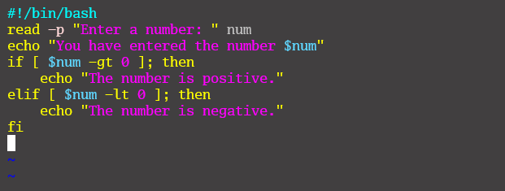

# Linux Shell Scripting (Control Flow in Shell Scripting)
## Control Flow in Shell Scripting
Control flow statements are the backbone of making decisions in programming. In scripting, these statements let your scripts decide what
proceed based on conditions, loops, or user inputs.

## If Statement
* The **if statement** in Bash scripts allows you to execute commands based on conditions.

* Here is the output produced by the `if` condition in the script.

## Loop 
* **Loops** empower us to automate and repeat tasks without writing the same code over and over again.
  * **List Form:** Iterates over a list of items
    
    
  * Set the correct permission for the scripts
    
  * Here is the output produced by the loop iterating through the list.
    
  * **C-style Form:** This style allows you to specify an initialiser, condition, and increment/decrement expression. It is based on the same syntax used to do a `for` loop in C programming.
    
  * Here is the output produced by the loop iterating through the C-style.
    
