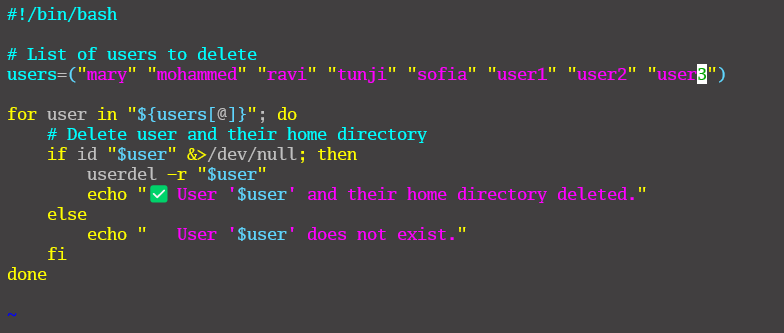

# Linux Shell Scripting (Comments)
## Adding Comments in Bash Scripts
Comments are essential in programming. They serve as notes to the programmer and anyone else who might read the code.
They explain what the script or parts of the script do, making the code easier to understand and maintain. This section will guide you on how to add comments in Bash scripts.
#

* **Creating a Commented Script with Vim:**
  A `commented_script.sh` file was created using Vim.
  

* **Single-Line Comment Example:**
  The `commented_script.sh` file contains single-line comment code snippets.
  

* **Creating a Script with Multiple Single-Line Comments:**
  A `multiple_line_comment.sh` file was created using Vim to demonstrate multiple single-line comments.
  
  

* **Multiple Comment Example:**
  The `multiple_line_comment.sh` file contains several single-line comments within the script.
  

* **Creating a User Deletion Script:**
  A `delete_users.sh` script was created using Vim to handle user deletion.
  

* **User Deletion Code:**
  The `delete_users.sh` file contains the necessary code to delete users from the system.
  

* **Listing Shell Scripts:**
  All `.sh` files in the directory were listed using the `ls` command.
  

* **Output – Commented Script:**
  Output generated after running the script: `./commented_script.sh`.
  

* **Output – Multiple Line Comments Script:**
  Output generated after executing: `./multiple_line_comment.sh`.
  

* **Output – Delete Users Script:**
  Output after executing the script with elevated permissions: `sudo ./delete_users.sh`.
  

