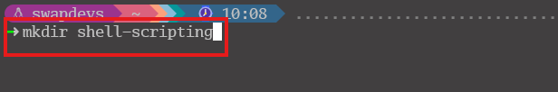
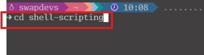
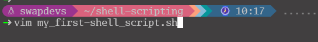
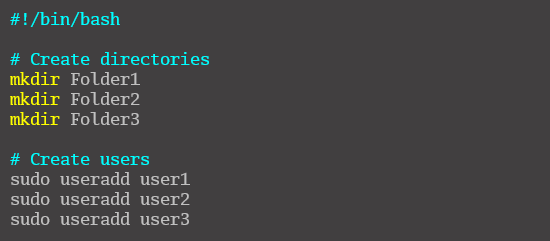
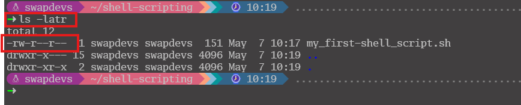
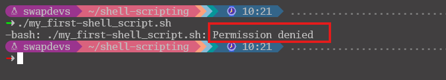
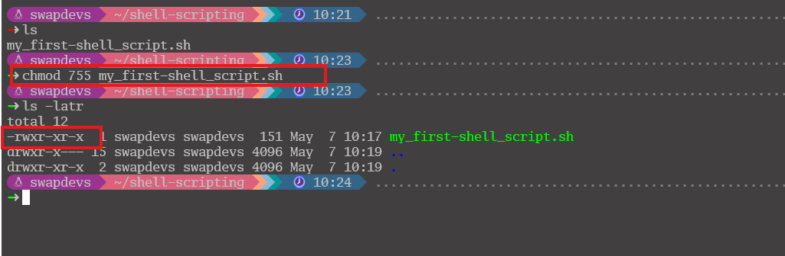
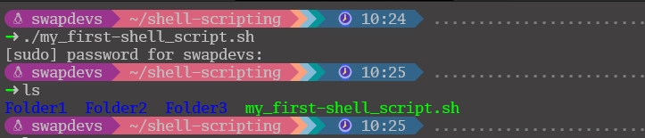
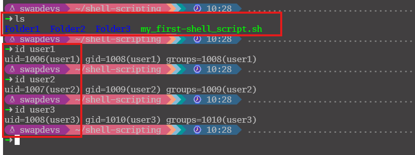

## Linux Shell Scripting (Mini)
# Task 1: 
- Create a folder on an Ubuntu server and name it shell-scripting.
  

- Use *cd* command to change into the *shell-scripting* directory

- Using the *Vim* editor, create a file called *my_first_shell_script.sh*
  

- Put the shell script code above into the new file.
  

- Use the `ls -latr` command to confirm the file is created.

## Task 2: 
- **Permission denied error** which can easily be resolved by giving the file the necessary permission it requires.
  

- Add the execute permission for the `owner` to be able to execute the shell script
  

- Run the shell script.
  

- Evaluate and ensure that 3 folders are created and Evaluate and ensure that 3 users are created on the linux server
  

